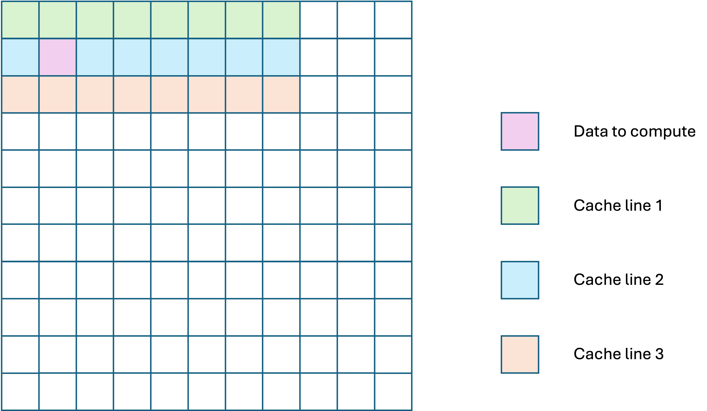
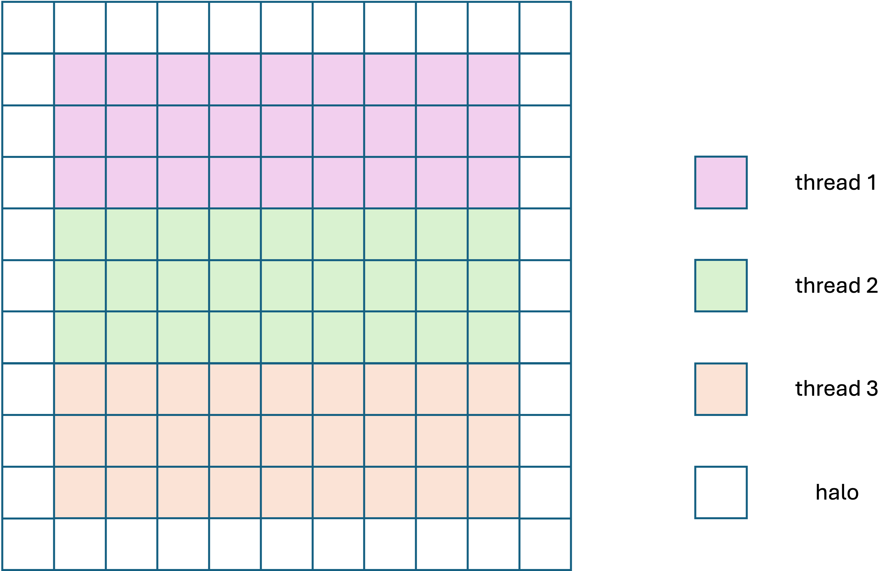
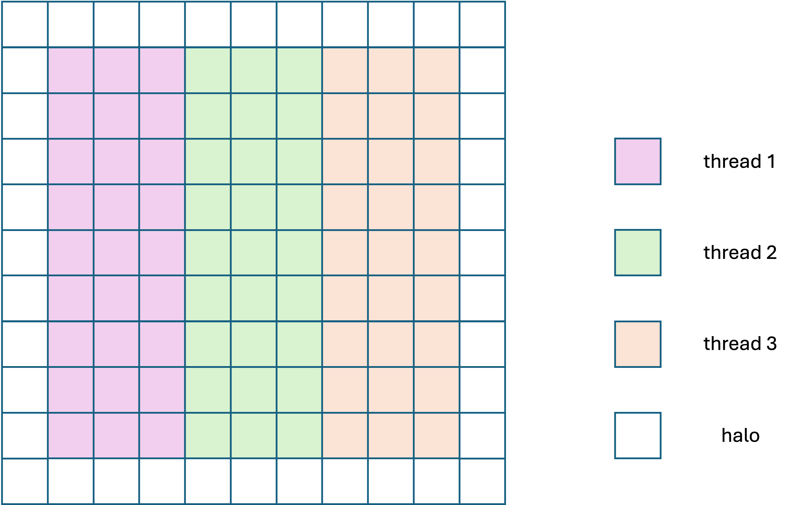
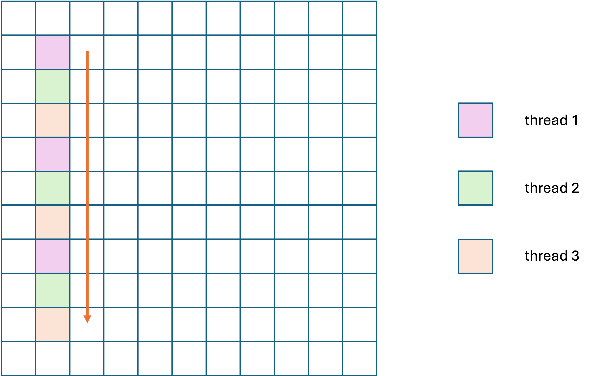
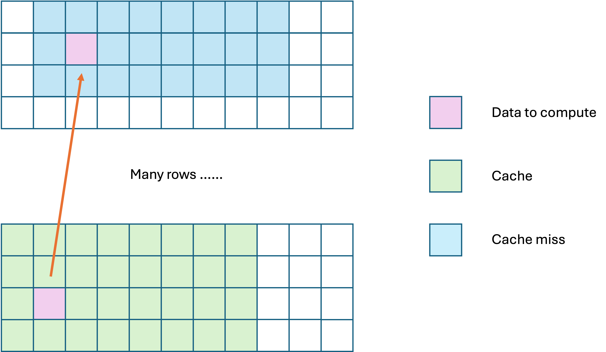
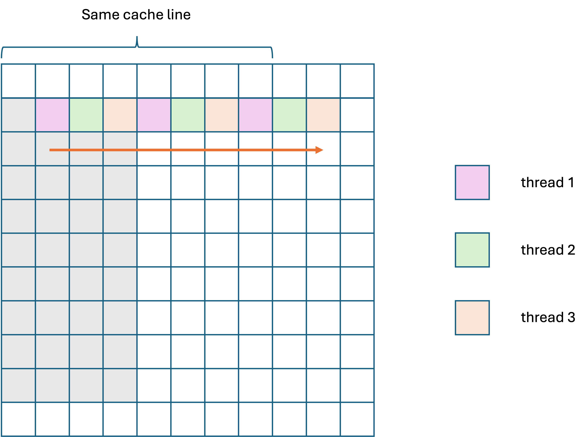
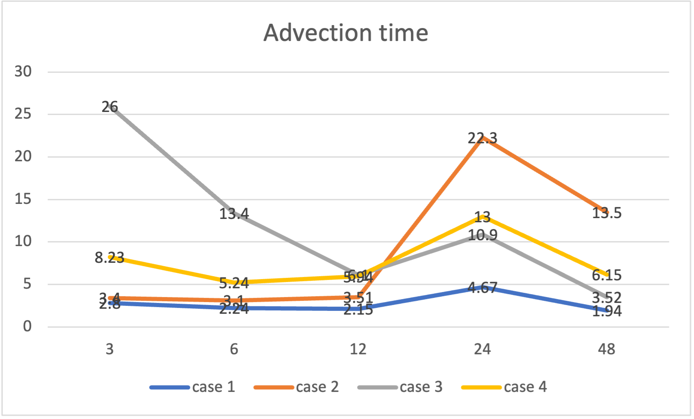
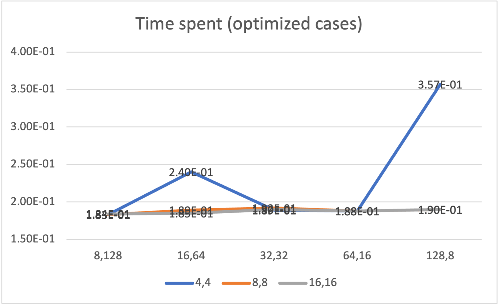

# OpenMP
## Parallelization via 1D decomposition
### Some concepts
#### Cache and cache line
Each thread has its own L1 cache. When there occurs a cache miss, the thread will load a cache line (in studpu2 server 64 bytes) data to cache which is 8 elements of double data.

The figure below shows how cache line works. When updating the pink data, the advection solver has to load data adjacent to the element and the thread will load a sequent 8 elements (64 bytes, where to start depends on the start memory address) to cache.



#### False sharing
False sharing happens when more than one threads try to write data in one cache line. As each thread has to update cache before writing back, false sharing will decrease the speed significantly when there are a large amount of data.

### Maximize performance
```c
// case 1 
#pragma omp parallel for private(i, j) schedule(static)
for (i = 0; i < M; i++) {
    for (j = 0; j < N; j++) {
        v[i * ldv + j] =
            cim1 * (cjm1 * u[(i - 1) * ldu + j - 1] + cj0 * u[(i - 1) * ldu + j] +
                    cjp1 * u[(i - 1) * ldu + j + 1]) +
            ci0 * (cjm1 * u[i * ldu + j - 1] + cj0 * u[i * ldu + j] +
                    cjp1 * u[i * ldu + j + 1]) +
            cip1 * (cjm1 * u[(i + 1) * ldu + j - 1] + cj0 * u[(i + 1) * ldu + j] +
                    cjp1 * u[(i + 1) * ldu + j + 1]);
    }
}
```
In this case, threads can have a generally best space locality and avoid false sharing among threads.

The figure below shows how data are divided with thread number 3.



Read and write cache misses all happen when first load the data as shown in Figure. 1.

### Maximize the number of parallel region entry/exits
```c
for (i = 0; i < M; i++) {
// case 2
#pragma omp parallel for private(j)
    for (j = 0; j < N; j++) {
        v[i * ldv + j] =
            cim1 * (cjm1 * u[(i - 1) * ldu + j - 1] + cj0 * u[(i - 1) * ldu + j] +
                    cjp1 * u[(i - 1) * ldu + j + 1]) +
            ci0 * (cjm1 * u[i * ldu + j - 1] + cj0 * u[i * ldu + j] +
                    cjp1 * u[i * ldu + j + 1]) +
            cip1 * (cjm1 * u[(i + 1) * ldu + j - 1] + cj0 * u[(i + 1) * ldu + j] +
                    cjp1 * u[(i + 1) * ldu + j + 1]);
    }
}
```
This method parallelizes the computing in each row by column. For each row, threads are created to compute the data from left to right and exit the parallel region when it has done. For next row computing, threads will be created again. Thus, this is the approach with maximum parallel region entry/exits.



### Maximize cache misses involving read operations
```c
#pragma omp parallel for schedule(static, 1) collapse(2)
  for (j = 0; j < N; j++) {
    for (i = 0; i < M; i++) {
      v[i * ldv + j] =
          cim1 * (cjm1 * u[(i - 1) * ldu + j - 1] + cj0 * u[(i - 1) * ldu + j] +
                  cjp1 * u[(i - 1) * ldu + j + 1]) +
          ci0 * (cjm1 * u[i * ldu + j - 1] + cj0 * u[i * ldu + j] +
                 cjp1 * u[i * ldu + j + 1]) +
          cip1 * (cjm1 * u[(i + 1) * ldu + j - 1] + cj0 * u[(i + 1) * ldu + j] +
                  cjp1 * u[(i + 1) * ldu + j + 1]);
    }
  }
```
This method will result in read cache misses each loop step forward without false sharing. (Figure. 4) When hitting the bottom of the array, there is still cache misses as shown in Figure. 5 as data in memory are stored by rows.




### Maximize cache misses involving write operations
```c
// case 4
#pragma omp parallel for private(i, j) schedule(static, 1) collapse(2)
for (i = 0; i < M; i++) {
    for (j = 0; j < N; j++) {
        v[i * ldv + j] =
            cim1 * (cjm1 * u[(i - 1) * ldu + j - 1] + cj0 * u[(i - 1) * ldu + j] +
                    cjp1 * u[(i - 1) * ldu + j + 1]) +
            ci0 * (cjm1 * u[i * ldu + j - 1] + cj0 * u[i * ldu + j] +
                    cjp1 * u[i * ldu + j + 1]) +
            cip1 * (cjm1 * u[(i + 1) * ldu + j - 1] + cj0 * u[(i + 1) * ldu + j] +
                    cjp1 * u[(i + 1) * ldu + j + 1]);
    }
}
```
In this combination, there is highest possibility for all threads to write to the same cache line which gives rise to false sharing and thus result in highest cache misses involving write oprations. (Figure. 6)


### Comparison

# Cuda


Figure 7 shows the result of testing the advection solver of 5000 * 5000 for 100 steps by different thread number p.



Case 1 has the best performance. 

Advection time of case 2 increases significantly when thread number increases as case 2 will fork and join each loop step which takes much time. The more threads there are, the more extra time will be spent on forking and joining.

Advection time of case 3 decreases as thread number increases. This is because if there are more threads, the data will be divided into smaller blocks and there will be less cache miss within one thread level.

Advection time of case 4 generally has the same tendance with the best performace case 1 with higher time on synchronizing write cache among threads.


## Naïve approach

### Update boundary
I turned the threads to 1D fashion to divid the `N` elements and `M+2` elements to all threads to update. There are `n=blockDim.x * blockDim.y * gridDim.x * gridDim.y` threads so each thread will update `2 * N\n` data for both top and bottom and `2 * (M+2)\n` elements for both left and right boundary.

## Optimized approach
### Pointer swap
According to Vizitiu et al., the pointer to original data and caculated data (in this project array `u` and array `v) can be swapped to save copy time.

### Shared memory within one block
In naïve approach, all threads read data from global memory of the GPU which spends more time than reading from a shared memory. 

As data in shared memory are shared with all threads within one block, I created shared memory for each block and copy the data from global memory to shared memory before computing and loaded extra rows and columns as halo. After computation, each thread save computed data back to global memory `v`. After each step, using pointer swap indicated in previous paragraph, swap pointer of `u` and `v` to save copy time.

The figure below shows the advection time spent using optimized approach and it can be easily seen that the optimized approach has significantly speedup than the naïve approach. Additionally, the differences between different block sizes are not as apparent as the naïve approach unless when the grid size is very small.



