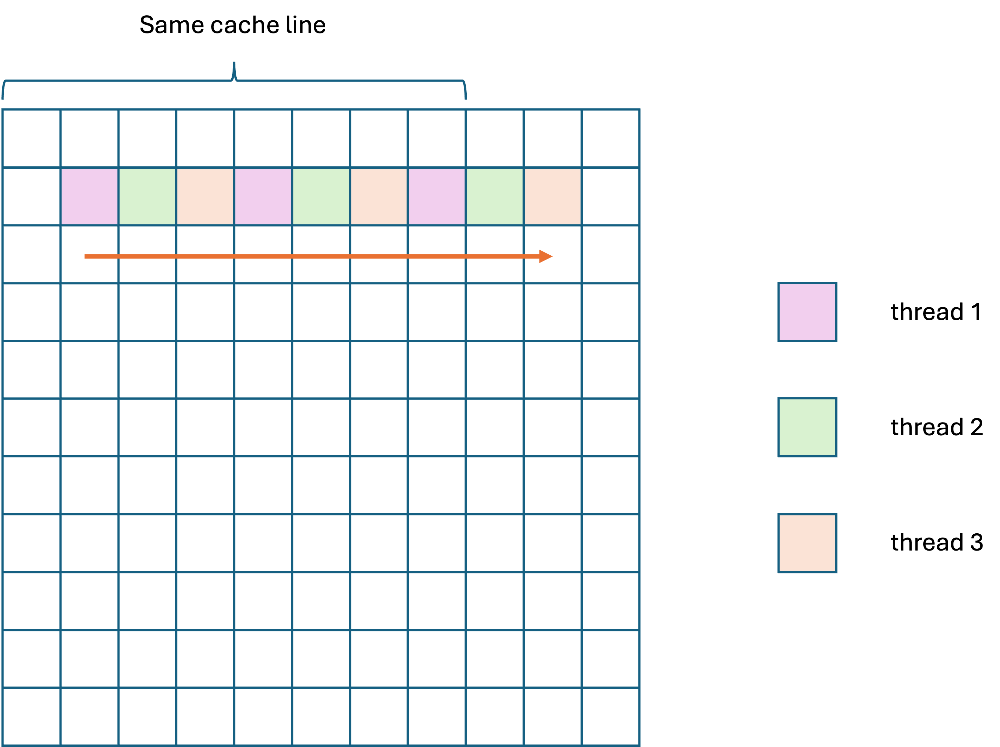

u7572718

Fangzhou Liu 

COMP8300 assignemtn 2 report

# OpenMP
## Parallelization via 1D decomposition
### Some concepts
#### Cache and cache line
Each thread has its own L1 cache. When there occurs a cache miss, the thread will load a cache line (in studpu2 server 64 bytes) data to cache which is 8 elements of double data.

The figure below shows how cache line works. When updating the pink data, the advection solver has to load data adjacent to the element and the thread will load a sequent 8 elements (64 bytes, where to start depends on the start memory address) to cache.


#### False sharing
False sharing happens when more than one threads try to write data in one cache line. As each thread has to update cache before writing back, false sharing will decrease the speed significantly when there are a large amount of data.

### Maximize performance
```c
// case 1 
#pragma omp parallel for private(i, j) schedule(static)
for (i = 0; i < M; i++) {
    for (j = 0; j < N; j++) {
        v[i * ldv + j] =
            cim1 * (cjm1 * u[(i - 1) * ldu + j - 1] + cj0 * u[(i - 1) * ldu + j] +
                    cjp1 * u[(i - 1) * ldu + j + 1]) +
            ci0 * (cjm1 * u[i * ldu + j - 1] + cj0 * u[i * ldu + j] +
                    cjp1 * u[i * ldu + j + 1]) +
            cip1 * (cjm1 * u[(i + 1) * ldu + j - 1] + cj0 * u[(i + 1) * ldu + j] +
                    cjp1 * u[(i + 1) * ldu + j + 1]);
    }
}
```
In this case, threads can have a generally best space locality and avoid false sharing among threads.

The figure below shows how data are divided with thread number 3.


Read and write cache misses all happen when first load the data as shown in Figure. 1.

### Maximize the number of parallel region entry/exits
```c
for (i = 0; i < M; i++) {
// case 2
#pragma omp parallel for private(j)
    for (j = 0; j < N; j++) {
        v[i * ldv + j] =
            cim1 * (cjm1 * u[(i - 1) * ldu + j - 1] + cj0 * u[(i - 1) * ldu + j] +
                    cjp1 * u[(i - 1) * ldu + j + 1]) +
            ci0 * (cjm1 * u[i * ldu + j - 1] + cj0 * u[i * ldu + j] +
                    cjp1 * u[i * ldu + j + 1]) +
            cip1 * (cjm1 * u[(i + 1) * ldu + j - 1] + cj0 * u[(i + 1) * ldu + j] +
                    cjp1 * u[(i + 1) * ldu + j + 1]);
    }
}
```
This method parallelizes the computing in each row by column. For each row, threads are created to compute the data from left to right and exit the parallel region when it has done. For next row computing, threads will be created again. Thus, this is the approach with maximum parallel region entry/exits.


### Maximize cache misses involving read operations
```c
#pragma omp parallel for schedule(static, 1) collapse(2)
  for (j = 0; j < N; j++) {
    for (i = 0; i < M; i++) {
      v[i * ldv + j] =
          cim1 * (cjm1 * u[(i - 1) * ldu + j - 1] + cj0 * u[(i - 1) * ldu + j] +
                  cjp1 * u[(i - 1) * ldu + j + 1]) +
          ci0 * (cjm1 * u[i * ldu + j - 1] + cj0 * u[i * ldu + j] +
                 cjp1 * u[i * ldu + j + 1]) +
          cip1 * (cjm1 * u[(i + 1) * ldu + j - 1] + cj0 * u[(i + 1) * ldu + j] +
                  cjp1 * u[(i + 1) * ldu + j + 1]);
    }
  }
```
This method will result in read cache misses each loop step forward without false sharing. (Figure. 4) When hitting the bottom of the array, there is still cache misses as shown in Figure. 5 as data in memory are stored by rows.


### Maximize cache misses involving write operations
```c
// case 4
#pragma omp parallel for private(i, j) schedule(static, 1) collapse(2)
for (i = 0; i < M; i++) {
    for (j = 0; j < N; j++) {
        v[i * ldv + j] =
            cim1 * (cjm1 * u[(i - 1) * ldu + j - 1] + cj0 * u[(i - 1) * ldu + j] +
                    cjp1 * u[(i - 1) * ldu + j + 1]) +
            ci0 * (cjm1 * u[i * ldu + j - 1] + cj0 * u[i * ldu + j] +
                    cjp1 * u[i * ldu + j + 1]) +
            cip1 * (cjm1 * u[(i + 1) * ldu + j - 1] + cj0 * u[(i + 1) * ldu + j] +
                    cjp1 * u[(i + 1) * ldu + j + 1]);
    }
}
```
In this combination, there is highest possibility for all threads to write to the same cache line which gives rise to false sharing and thus result in highest cache misses involving write operations. (Figure. 6)



### Comparison

Figure 7 shows the result of testing the advection solver of 5000 * 5000 for 100 steps by different thread number p. The x-axis is the number of threads.


Case 1 has the best performance. 

Advection time of case 2 increases significantly when thread number increases as case 2 will fork and join each loop step which takes much time. The more threads there are, the more extra time will be spent on forking and joining.

Advection time of case 3 decreases as thread number increases. This is because if there are more threads, the data will be divided into smaller blocks and there will be less cache miss within one thread level.

Advection time of case 4 generally has the same tendance with the best performance case 1 with higher time on synchronizing write cache among threads.

### Parallel in update boundary
I first create a parallel region at the beginning to avoid recreate threads after updating top and bottom. The threads can be reused for updating left and right sides of halo to save time on joining and forking.

```c
void omp_update_boundary_1D_decomposition(double *u, int ldu) {
#pragma omp parallel
  {
  int i, j;
#pragma omp for private(j)
    for (j = 1; j < N + 1; j++) { // top and bottom halo
      u[j] = u[M * ldu + j];
      u[(M + 1) * ldu + j] = u[ldu + j];
    }
#pragma omp for private(i)
    for (i = 0; i < M + 2; i++) { // left and right sides of halo
      u[i * ldu] = u[i * ldu + N];
      u[i * ldu + N + 1] = u[i * ldu + 1];
    }
  }
}
```

The result shows it can increase speed up slightly comparing with no optimization.

| thread number | 3    | 6    | 12   | 24   | 48   |
|---------------|------|------|------|------|------|
| without opt in boundary update | 2.72 | 2.19 | 2.13 | 2.26 | 1.94 |
| opt in boundary update         | 2.69 | 2.19 | 2.13 | 2.28 | 1.52 |

## 2D decomposition
I choose the thread number 12 which is the best performance in case 1 with optimization of updating boundary. The base advection time is 2.13 seconds. The result shows that the 2D decomposition method increases cost slightly.

| PxQ  | 1,12 | 2,6 | 3,4 | 4,3 | 6,2 | 12,1 |
|------|------|-----|-----|-----|-----|------|
|   Advection time (s)   | 2.23 | 2.17| 2.16| 2.15| 2.14| 2.13 |

### OpenMP and MPI comparison
Comparing with using 2D composition in MPI, OpenMP have relatively better performance. Threads can share memory space and L3 cache in OpenMP and it does not require much time for communication and synchronization. However, MPI should explicitly communicate i.e. sending and receiving boundaries which takes much time.

### 2D and 1D composition
The result shows there is a slight increase on advection time using 2D composition. This is because 2D composition will break space locality which results in more cache misses within one thread if `P` is not equal to `p`. Figure 8 shows that data in next row are not stored sequently if there are other threads on its right.


# Cuda

## Naïve approach

### Update boundary
I turned the threads to 1D fashion to divide the `N` elements and `M+2` elements to all threads to update. There are `n=blockDim.x * blockDim.y * gridDim.x * gridDim.y` threads so each thread will update `2 * N\n` data for both top and bottom and `2 * (M+2)\n` elements for both left and right boundary.

### Comparison
#### Different grid size and block size 
I choose to test the solver using 4096 * 4096 elements for 100 steps. Figure 9 below shows the result using different grid and block sizes.

The x-axis represents the block size `Bx,By` and lines with different colours represent the grid size `Gx,Gy`. The figure shows that best performance cases happen between the areas with combinations of grid size and block size both at around `2,32` to `4,16` which is indicated in the red square of the figure.

Cases with block size `B,1` perform the worst as distribution of data vertically will break space locality which is similar with the cases in OpenMP in the previous chapter.


### CPU and GPU
I tested the speedup with grid `1,1` and block `1,1` for computing 1024 * 1024 for 10 steps using GPU, GPU serialized and CPU. Results are shown as follows.

|                | GPU | GPU serialize | CPU   |
|----------------|-----|---------------|-------|
| Advection time (s) | 9.26 | 4.26          | 0.285 |


## Optimized approach
### Pointer swap
According to Vizitiu et al., the pointer to original data and calculated data (in this project array `u` and array `v`) can be swapped to save copy time.

### Shared memory within one block
In naïve approach, all threads read data from global memory of the GPU which spends more time than reading from a shared memory. 

As data in shared memory are shared with all threads within one block, I created shared memory for each block and copy the data from global memory to shared memory before computing and loaded extra rows and columns as halo. After computation, each thread save computed data back to global memory `v`. After each step, using pointer swap indicated in previous paragraph, swap pointer of `u` and `v` to save copy time.

The figures of two different approaches are as follows.


### Result

The figure below shows the advection time spent using optimized approach and it can be easily seen that the optimized approach has significantly speedup than the naïve approach. Additionally, the differences between different block sizes are not as apparent as the naïve approach unless when the grid size is very small.


I tested computation of 5120 * 5120 elements for 100 steps and the results are shown as follows. The x-axis represents different grid size and lines with different colours represents different block size and whether adopting optimized approach.

We can see a significant boost on speedup using optimized approach.

# Other information
This assignment is done by myself with some help of ChatGPT 4o.

# References

[1] Vizitiu, A., Itu, L., Niță, C., & Suciu, C. (Year). Optimized Three-Dimensional Stencil Computation on Fermi and Kepler GPUs. Siemens Corporate Technology, SC Siemens SRL. Transilvania University of Brașov, Brașov, Romania.

[2] Markidis, S., CUDA – Stencils and Shared Memory, KTH Royal Institute of Technology, https://indico.fysik.su.se/event/6537/contributions/9354/attachments/4029/4628/4.CUDA-StencilsSharedMemory-Markidis.pdf

[3] Harris, M., Using Shared Memory in CUDA C/C++, https://developer.nvidia.com/blog/using-shared-memory-cuda-cc/